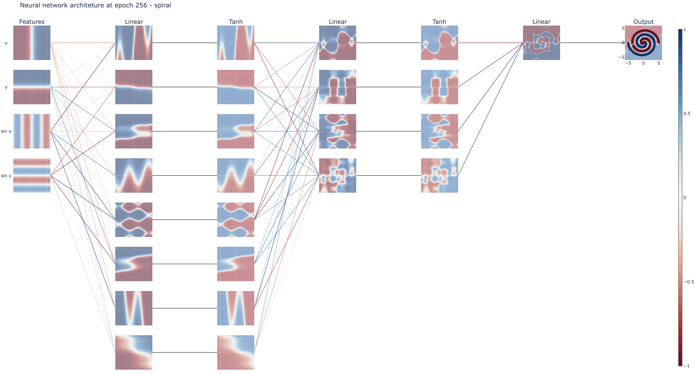

# PlotNet

PlotNet, inspired by the [TensorFlow Playground](https://playground.tensorflow.org/), allows for visualizing the structure and training process of multi-layer perceptrons (MLPs). The MLPs are implemented in PyTorch, and the visualizations are generated by Plotly. The figure below shows an example plot of the MLP architecture. To create new visualizations, access the [example notebook](https://colab.research.google.com/drive/1llqNm1V5Z1GrqCLTmdsMk3ZKgdvcpcWD?usp=sharing) and execute it in Google Colab.

